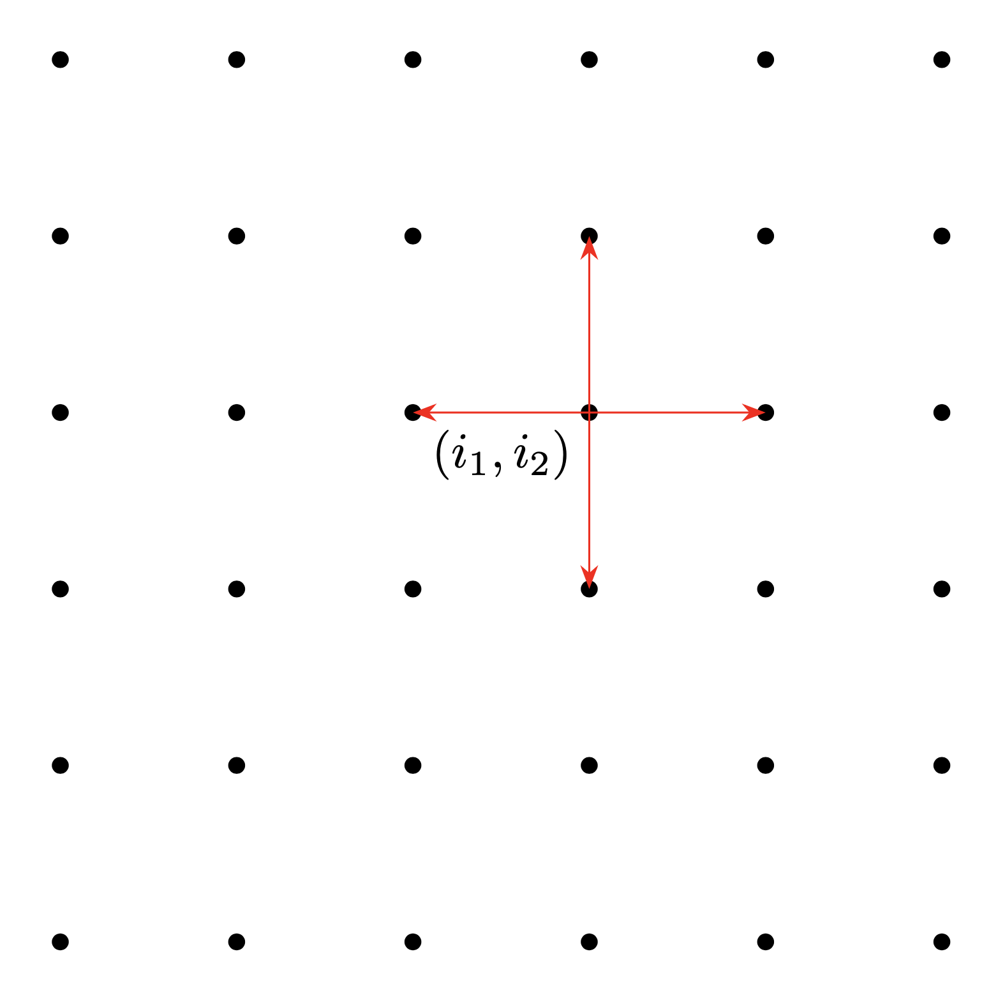

# Binary Choices of Groups of People using An Ising-Like Model

TO DO:
| Item | Done or not |
|------|-------------|
|create random lattice | DONE |
| interaction function | |
| magnetic moment function | |
| external influece function | |
| long range function | |
| choice changing function | |
| choice changing function for some number of times | |

## Ising Model
The Ising model is a mathematical model of ferromagnetism in statistical mechanics. The model consists of discrete variables that represent the atomic spins of atoms in a lattice, which can be either $+1$ or $-1$. Neighboring spins that have the same spin, have a lower energy than those that do not. 

The Hamiltonian of the basic Ising model is given by
$$H = - \sum_{\langle i,j \rangle} J_{ij} \sigma_i \sigma_j - h \sum_i \mu_i \sigma_i,$$
where $J_{ij}$ is the interaction between lattice site $i$ and $j$, $\sigma_k \in \{-1,+1\}$ ($k \in$ lattice), $\mu_i$ is the magnetic moment and determines how strong the spin of lattice site $i$ interacts with the external field $h$. The notation $\langle i,j \rangle$ indicates that sites $i$ and $j$ are nearest neighbors (NN). There are three cases for value or sign of $J_{ij}$:
- $J_{ij} > 0$: the spins favor to line up with the spins on neighbouring sites in the same direction (ferromagnetism);
- $J_{ij} < 0$: the spins favor anti-alignment of spins on neighbouring sites (ant-ferromagnetism);
- $J_{ij} = 0$: no interaction between neighboring spin sites.

Simmilarly, for external field $h$ the cases are:
- $h > 0$: the spin site $j$ favor to line up in the positive direction
- $h < 0$: the spin site $j$ favor to line up in the negative direction
- $h = 0$: there is no external field influence on the spins

On a 1D lattice, site $i$ has coordinate $i$. On a 2D lattice, every site is characterized by two coordinates $(i_1,i_2)$. It is then trivial to extend this to $N$ dimensions, where every site has $N$ coordinates $(i_1,\ldots, i_N)$.

The figure below is a representation of a $2D$ lattice, where the red arrows go from site $(i_1,i_2)$ its nearest neighbours. 

The probability of accepting the spin flip is given by
$$p_i = \min\left( 1, \exp{(-\beta \Delta E_i)} \right),$$
where 
$$\beta = 1/ (k_BT)$$
is the inverse temperature,
$$\Delta E_i = E_{k,i} - E_0 = 2\sigma_i \sum_{j: \langle i,j \rangle} J_{ij} \sigma_j + 2 h \mu_i \sigma_i \quad \text{for fixed i}$$
is the energy of site $i$.

## The Model and its Assumptions
I postulate that a lattice model can describe social behaviour of large groups. In this model I use the Ising model as basis to model the choice behaviour of groups of people that are given a binary choice: $+1$ or $-1$. One can assign any binary choice to either values.

Below the model and its assumptions is explained and discussed.

### Dimension of the model
In a square lattice the number of NN are $2d$, where $d$ is the dimension of the lattice. This model assumes that the average person can be influenced by its NN. For computational simplicity and for visualization purposes, this model assumes that the lattice is 2D, which limits the number of NN to four. Thus there are four people that can directly influence a person. The assumption that every person has four close relations which may be able to influence that person is not very unrealistic, although real life relations are much more complex. 

This model is a 2D and thus uses a finite 2D rectangular lattice. If every person needs to have four NN, the boundaries need to be periodic. The lattice therefore has the geometry of a two dimensional torus.

### Interaction between NN sites $J$
For the interaction term between NN I have chosen that the people act like a ferromagnetic lattice, such that it is favorable for people to align their choice or opinion with their NN. $J$ is a $4$ dimensional matrix: $J_{(ij)(kl)}$. Where between the brackets are the lattice site coordinates, and where $k \in \{ i-1,i,i+1 \}$ and $j \in \{ j-1,j,j+1 \}$, bcause we are dealing with NN interactions. Then for a lattice site at coordinate $(i_1,i_2)$ the matrix looks like:

$$ J_{(i_1i_2)(kl)} = \begin{bmatrix} J_{i_1+1,i_2-1} & J_{i_1+1,i_2} & J_{i_1+1,i_2+1} \\ J_{i_1,i_2-1} & J_{i_1,i_2} & J_{i_1,i_2+1} \\ J_{i_1-1,i_2-1} & J_{i_1-1,i_2} & J_{i_1-1,i_2+1} \end{bmatrix}$$

Because we are dealing with NN interactions all other, the only non-zero components of this matrix are $J_{i_1+1,i_2},J_{i_1,i_2-1}, J_{i_1,i_2}, J_{i_1,i_2+1}$ and $J_{i_1-1,i_2}$. If one would like to extend to next to nearest neighbour interactions (NNN), the whole matrix given above is non-zero. For NNN interactions the value of $J$ may also be smaller than for the NN interactions. 

One may choose the interaction strength for NN to be $1$ _**CHECK!!!!!**_

### Long range interactions
It is a good approximation of large groups, that there are a few people in the group which extend their reach to the entire lattice. Although these few sites (people) extend their influence to the entire lattice, it may be a good choice to have these sites have a larger influence on the NN and NNN, but let their influence on sites of a larger distance than $\sqrt{2}$ be smaller. 
This choice can be some fraction of the $J$ for NN. _**WHAT FRACTION?!?!?!**_

### 'Magnetic moment' $\mu$
The magnetic moment is chosen to be coordinate dependent, because some people are influenced more by external stimuli or influences than others. The magnetic moment can be positive or negative. If $\mu>0$ the influence of $h$ on the spin stays the same as explained above, and if $\mu<0$ the signs change in the above explanation of $h$. Thus if $\mu > 0$ the spin favors alignment with $h$ and if $\mu < 0$ it favors anti-alignment with $h$. Thus if $\mu >0$ the site favors what the external effect $h$ would like to accomplish, and if $\mu < 0$ the site favors the opposite of what the external effect $h$ would like to accomplish.

One may choose the magnetic moment themselves, but one may also leave this to the model. 

If one chooses the model to choose $\mu$, it looks at every site and $\frac{1}{\#NN}$ times sums the spins of the NN - in this case $\frac{1}{4}$ - and adds to it the spin of the site itself: $\mu \in \{ -2,-1.5,-1,0.5,0,0.5,1,1.5,2 \}$ and thus always has some effect:
$$\mu_j = \sigma_j + \frac{1}{\# NN} \sum_i \sigma_i$$ 
If $\mu = 0$, then the probability of being affected positively ($1$) or negatively ($-1$) by will be $\frac{1}{2}$. 

There is one caviate, because there are also sites which influence the whole lattice. These sites will be influenced less by other sites when there is an external influence. For example, the opinion of a politician is less easily changed by the other politicians then non-politicians. Although these sites will feel some influence of their surrounding sites, the collective has to have an impact on that site, rather than individual sites. Therefore the following rule is established for the sites which exert influence on the entire lattice: $$\mu_j = \sigma_j + \frac{1}{2\# NN} \cdot \sum_{i \in NN} \sigma_i + \frac{1}{N - \#NN -1} \sum_{i \notin NN, i\neq j} \sigma_i,$$ 
where $N$ is the total number of lattice sites and $\#NN$ is the number of NN. If this is equal to zero, the $\mu_j = \sigma_j$. The factor in front of the NN term is half that of the 'normal' sites. I have chosen to half it, because an influencial person is overall less influenced by individuals than a 'normal' person might be. 

### External influence $h$
The external field $h$ can be thought of some type of propaganda or news, which is able to change the minds of a fraction of the whole group. This can be positive to align along $+1$ spin direction or negative to align along the $-1$ spin direction. How larger the external influence $h$ is chosen to be, the likelier the spins align along direction of the external influence.

### Temperature as layer of randomness
A high temperature gives a low value of $\beta$ and a low temperature gives a high value of $\beta$: $T \to 0 \Longrightarrow \beta \to \infty$ and $T \to \infty \Longrightarrow \beta \to 0$. An increasing temperature creates a more random system, while a low temperature makes the system more fixed and less likely to change. A possible analogy to temperature may be the influence of fake news, social media or crises. These forms of influence on people may create more 'randomness' to a system, because people - under these influences - may be more unpredictable. NOTE: $T > 0$, since temperature cannot be negative.

### Changing the choice
The probability of accepting a spin flip at cite $i$ is given by 
$$p_{\text{accept},i} = \min\left( 1, e^{-\beta \Delta E_i} \right).$$
It is trivial to see that the rejection probability it 
$$p_{\text{reject},i} = 1 - p_{\text{accept},i}.$$
It may not be favorable (and realistic) to have sites (people) changing spin (opinion or choice) every iteration, if one does multiple iterations of the algorithm. Thus I have implemented a rule that states that the probability is smaller by a factor of $2$ when it has changed its sign in the last iteration.

### Overview of the model
- flow chart maybe? Or something? I don't know yet.

## Using the Code
- Calling function which models
- Calling function which plots
- Calling function which animates

## Diving into the Model
- Go through code and explain